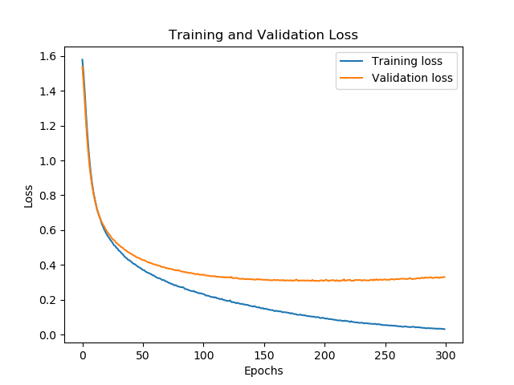
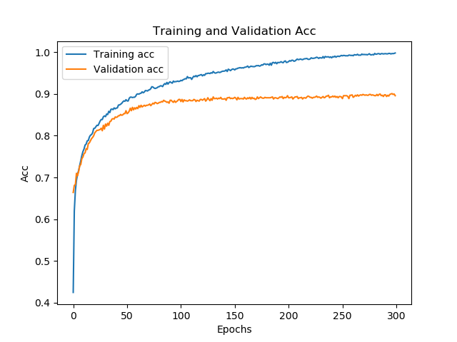
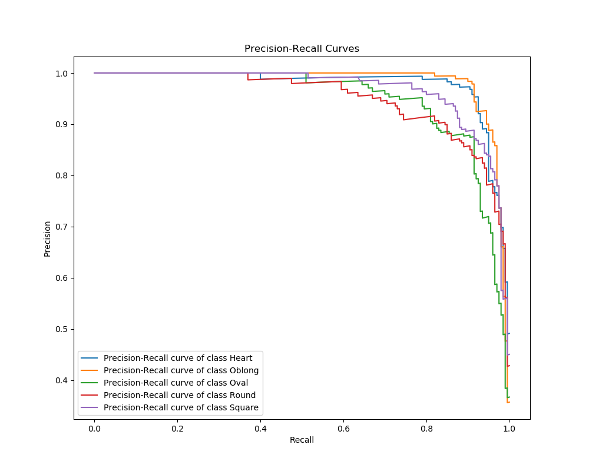

# SUMMARY
This AI-powered application analyzes the uploaded photos of users to determine their face shapes and provides personalized hairstyle recommendations.
In this way, users can easily find the most suitable hairstyle for their face shape. The system examines various features of the face to classify the face shape and matches it with predefined hairstyles.

This project aims to accelerate users' decision-making processes in hairstyle selection and help them make the right choice.

---

# SYSTEM WORKFLOW  
1. Take a photo using the system's camera.  

2. Analyze your head structure and show which head shape you have.  

3. Present you with pre-prepared hairstyles based on your head shape.  

4. Choose the most suitable one for yourself and tell your hairdresser!  

---

# TECHNOLOGIES  

## Data Processing  
- joblib  
- pickle  
- numpy  
- opencv  

## Face Detection  
- MTCNN  

## Web  
- Python Flask  
- HTML & CSS  
- JavaScript  

## Model  
- VGGFace  
- Keras (v2.2.4)  
- Tensorflow (v1.14.0)  

**Deep Learning → Transfer Learning**

---

# DATASET
This dataset consists of a total of 5000 images of celebrities categorized by face shapes from all around the world: Heart, Oblong, Oval, Round, and Square.  

Each category contains 1000 images.  
The Training Set for each category includes 800 images, while the Test Set includes 200 images.  

---

# MODEL PERFORMANCE METRICS

## Overview
This section provides detailed performance metrics for the model, including accuracy, precision, recall, F1-score, log loss, and AUC score. Additionally, the classification report offers insights into the performance of each class.

## Metrics
- **Accuracy**: 0.8960
- **Precision (Weighted)**: 0.8962
- **Recall (Weighted)**: 0.8960
- **F1-Score (Weighted)**: 0.8959
- **Log Loss**: 0.3301
- **AUC Score (Weighted)**: 0.9884

## Classification Report
| Class     | Precision | Recall | F1-Score | Support |
|-----------|-----------|--------|----------|---------|
| Heart     | 0.92      | 0.93   | 0.92     | 200     |
| Oblong    | 0.93      | 0.93   | 0.93     | 200     |
| Oval      | 0.89      | 0.84   | 0.87     | 200     |
| Round     | 0.86      | 0.89   | 0.87     | 200     |
| Square    | 0.89      | 0.90   | 0.89     | 200     |

---

# VISUALIZATIONS
Below are the visualizations generated during model evaluation. All images are resized to maintain uniformity.

## Confusion Matrices
| Confusion Matrix (Counts) | Confusion Matrix (Normalized) |
|----------------------------|------------------------------|
| { width=400 } | { width=400 } |

## Training & Validation Metrics
| Log Loss | Validation Accuracy |
|----------|---------------------|
| { width=400 } | { width=400 } |

## Precision-Recall and ROC Curves
| Precision-Recall Curves | ROC Curves |
|--------------------------|-----------|
| { width=400 } | { width=400 } |

---

# RESOURCES

- [VGGFace](https://github.com/rcmalli/keras-vggface)
- [Face Shape Dataset](https://www.kaggle.com/datasets/niten19/face-shape-dataset)  