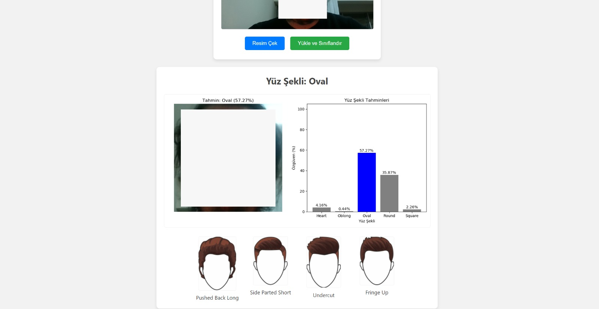
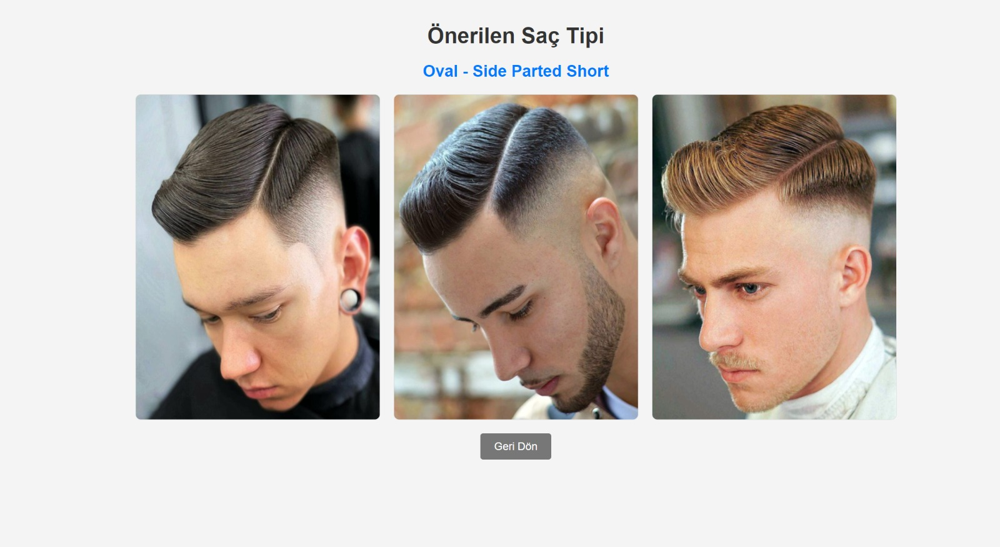
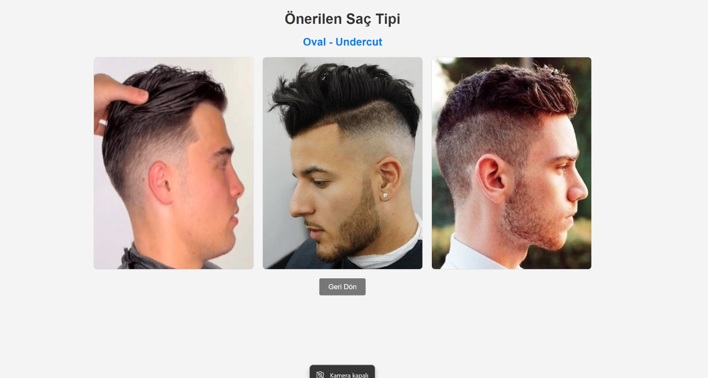

# ShapeStyle

## Overview
An AI-powered web application that analyzes user photos to determine face shapes and provides personalized hairstyle recommendations. Using deep learning and transfer learning techniques, the system classifies faces into five categories (Heart, Oblong, Oval, Round, Square) and suggests optimal hairstyles for each shape.

## Purpose
To help users find the most suitable hairstyle for their face shape through automated facial analysis. The application aims to accelerate decision-making in hairstyle selection and ensure users make the right choice by matching their facial features with predefined hairstyle recommendations.

### Key Objectives:
- Accurately classify face shapes using computer vision
- Provide personalized hairstyle recommendations
- Create an intuitive web interface for real-time analysis
- Achieve high accuracy in facial shape detection

## Scope

### Technology Stack:
- **Deep Learning**: VGGFace, Keras 2.2.4, TensorFlow 1.14.0
- **Face Detection**: MTCNN
- **Web Development**: Python Flask, HTML/CSS, JavaScript
- **Data Processing**: NumPy, OpenCV, joblib, pickle
- **Transfer Learning**: Pre-trained VGG16 architecture

### Project Features:
- Real-time camera capture for face analysis
- 5-class face shape classification (Heart, Oblong, Oval, Round, Square)
- Personalized hairstyle recommendations with visual previews
- Interactive web interface with user-friendly design
- Model performance metrics and visualization tools

## Implementation

### Project Structure:
```
ShapeStyle/
├── model/
│   ├── face_shape_model_vgg16_rgb.h5    # Trained model
│   ├── evaluation_results/               # Performance metrics and graphs
│   ├── input_imgs/                       # Test images
│   ├── output_results/                   # Prediction results
│   ├── model_train.py                    # Model training script
│   ├── model_test.py                     # Model testing script
│   └── model_degerlendirme.py           # Model evaluation script
├── preprocessing/
│   ├── preprocessing.py                  # Data preprocessing script
│   └── preprocessing_control.py          # Data validation script
├── sac_onerisi/
│   ├── backend/
│   │   └── api.py                       # Flask API server
│   └── frontend/
│       ├── index.html                   # Main interface
│       ├── onerilen.html                # Hairstyle recommendations
│       └── [face_shape_folders]/        # Hairstyle images by face shape
└── requirements.txt
```

### System Workflow:
1. **Capture Photo**: User takes a photo using the system's camera
2. **Face Analysis**: MTCNN detects face and VGGFace analyzes facial structure
3. **Shape Classification**: Model predicts face shape with confidence scores
4. **Recommendations**: System displays personalized hairstyle suggestions
5. **Selection**: User selects preferred style for hairdresser reference

### Model Performance:
- **Accuracy**: 89.60%
- **Precision (Weighted)**: 89.62%
- **Recall (Weighted)**: 89.60%
- **F1-Score (Weighted)**: 89.59%
- **AUC Score (Weighted)**: 98.84%

### Classification Report:
| Face Shape | Precision | Recall | F1-Score | Support |
|------------|-----------|---------|----------|---------|
| Heart      | 0.92      | 0.93    | 0.92     | 200     |
| Oblong     | 0.93      | 0.93    | 0.93     | 200     |
| Oval       | 0.89      | 0.84    | 0.87     | 200     |
| Round      | 0.86      | 0.89    | 0.87     | 200     |
| Square     | 0.89      | 0.90    | 0.89     | 200     |

## Screenshots

### System Workflow




### Model Performance Visualizations


### Dataset:
- 5,000 celebrity images categorized by face shapes
- 1,000 images per category (Heart, Oblong, Oval, Round, Square)
- Training set: 800 images per category
- Test set: 200 images per category
